# inbound_parser
- The Jira inbound_parser allows possibly unknown senders to create Jira Servicedesk request, comment on them and receive any subsequent updates concerning their request.  
The application is written in Golang and to be deployed using Docker Compose (and Ansible).  
It exposes an HTTP endpoint for [Sendgrid's Inbound Parse Webhook](https://docs.sendgrid.com/for-developers/parsing-email/setting-up-the-inbound-parse-webhook), parses the email, performs certain actions on (multiple) Jira instances using the Jira Servicedesk API and sends reply emails.

# [docker_cron](https://github.ibmgcloud.net/dth/docker_cron)
- docker_cron needs to be installed on the host.

# Configuring Jira
- For all Projects on all Jira Instances make sure to set the `Customer permissions` to `Customers who have an account on this Jira site` or `Anyone can raise a request on the customer portal or by email`. You can do this in the **Project Settings** --> **Customer Permissions**

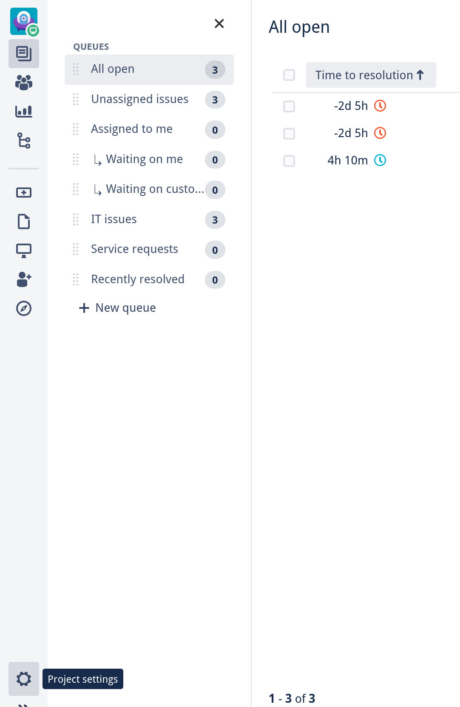 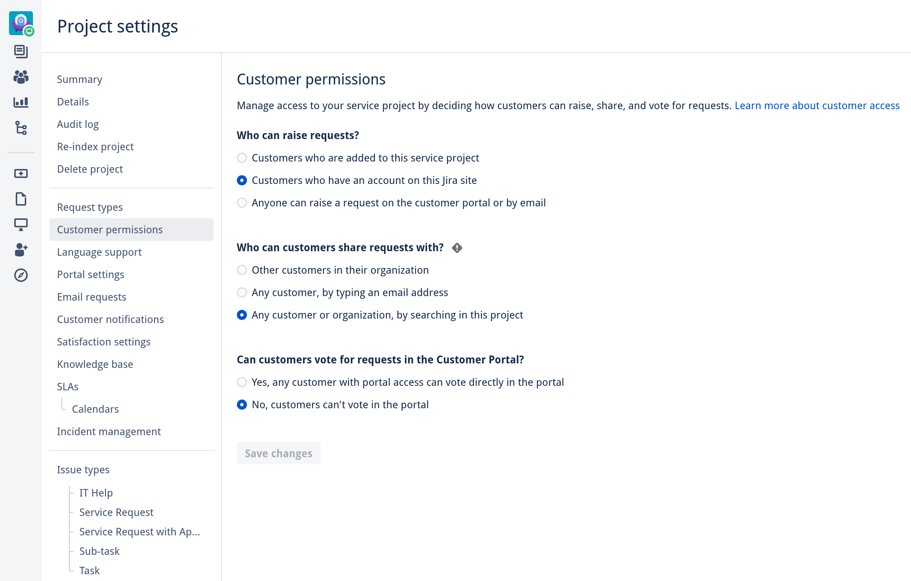

- You'll need one main token used to create requests, comments, ...  
    As the Jira install's admin create a new user under **JIRA ADMINISTRATION/User management/Users/Create user**.
    Give them any email address and a name like **MailMaster**.
    Then log in as that user and get a personal access token in their name under **Profile/Personal Access Tokens**.

- Going back to the admin account, you'll need to give the MailMaster some permissions.  
    Start by creating a new role under **JIRA ADMINISTRATION/System/Security/Project roles/Add Project Role**.
    A good name would be **inbound_parser**.
    Now go to the Jira Project the inbound_parser should work on under **Project settings/Users and roles/Add users to a role**.
    Add the MailMaster to the inbound_parser role.

- Finally that role needs to be equipped with all required permissions under **Project settings** --> **Permissions** --> **Actions** --> **Edit permissions** --> **Grant permission**.  
    Select all of these permissions:
    - Browse Projects
    - Service Desk Agent
    - View Read-Only Workflow
    - Assignable User
    - Assign Issues
    - Close Issues
    - Create Issues
    - Delete Issues
    - Edit Issues
    - Link Issues
    - Modify Reporter
    - Move Issues
    - Resolve Issues
    - Schedule Issues
    - Set Issue Security
    - Transition Issues
    - Manage Watchers
    - View Voters and Watchers
    - Add Comments
    - Delete All Comments
    - Delete Own Comments
    - Edit All Comments
    - Edit Own Comments
    - Create Attachments
    - Delete All Attachments
    - Delete Own Attachments
    - Delete Own Worklogs
    - Edit Own Worklogs
    - Work On Issues  
(You could definitely get away with selecting fewer of these.)

- Then select **Project Role** under **Granted to** and select the inbound_parser role.  
    You could also give the MailMaster the **Service Desk Team** role if it has the listed permissions (which it does by default).

- Optionally you'll need an admin token if the inbound_parser should create customers if needed.

- Now you need to set usable templates under **Project settings** --> **Customer notification** --> **Edit templates**.  
    Make sure that the first line is something like `=============REPLY ABOVE THIS LINE=============`.  
    E.g. for the text version:
    ```
    =============REPLY ABOVE THIS LINE=============

    ${message.content}

    Dear Valued Customer,
    ...
    ```

### Jira Request Status Automation
When a request's status is `Waiting for customer` you want a customer's comment to set the status back to `Waiting for support`.
Same goes for agents for requests in the `Waiting for support` status.
To achieve this, you need to write a Jira automation. First the legacy automation, which doesn't work for comments created via mail, needs to be removed.
Go to the Jira Project' **Project settings** --> **Legacy automation** and edit the `Transition on comment` automation. It should look similar to this and in the the bottom right untick the `Enable rule` checkbox and click `Save`.  
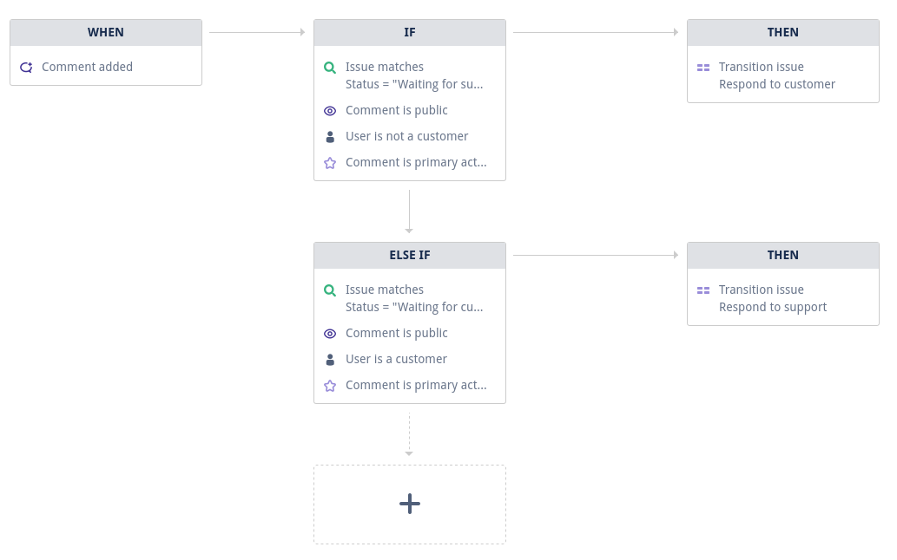  

Now go to **Project settings** --> **Automation** and click `Create rule`.
Create this `transition request to waiting for customer` automation: 
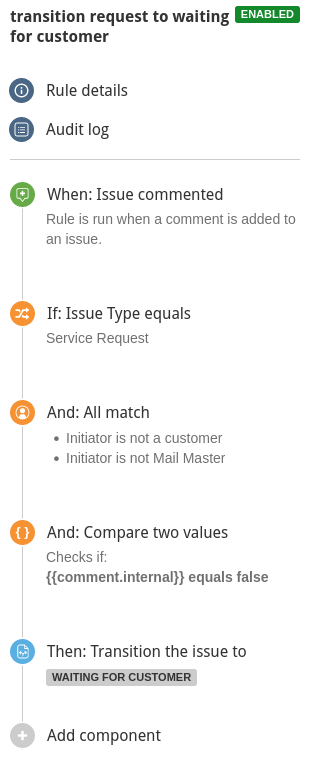  

Here are detailed screenshots:  
Select **Issue commented**  
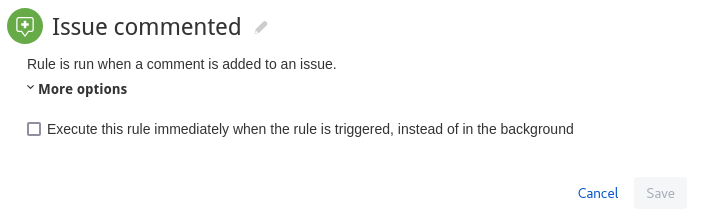  

Make sure that the issue type, here `Service Request`, is actually the one you use for the request type you select in the inbound_parser config.The request types are listed under **Project settings** --> **Request types** and the issue types under **Project settings**  --> **Issue types**.  
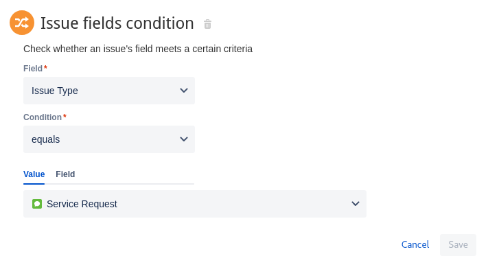  

Click `+ Add additional criteria` to allow for multiple checks.  
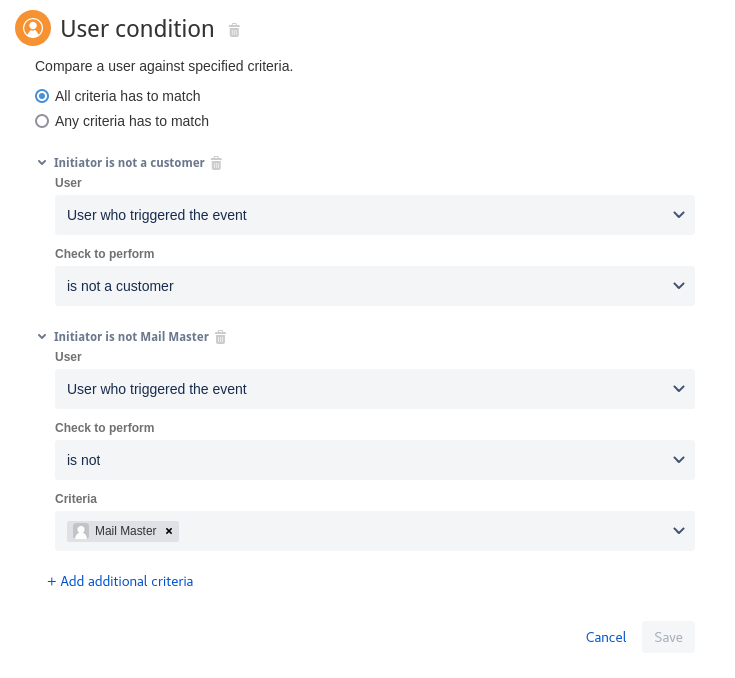  

`{{comment.internal}}`  
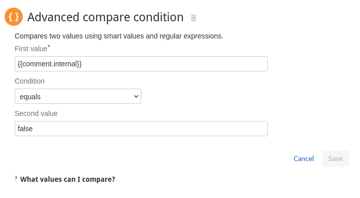  

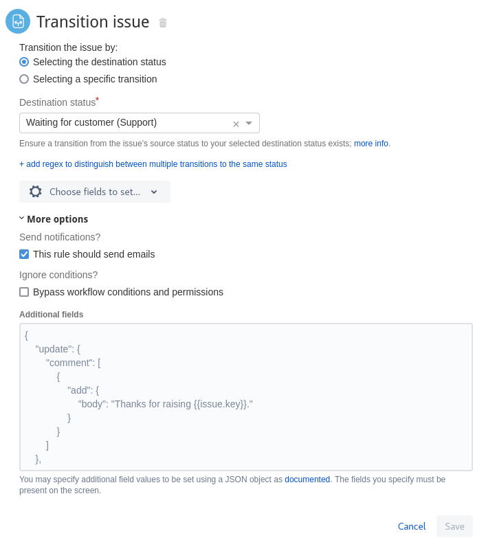  

Feel free to edit the rule details—maybe you want to transition to be performed by a specific user.  

Do the same for the `transition request to waiting for support` automation:  
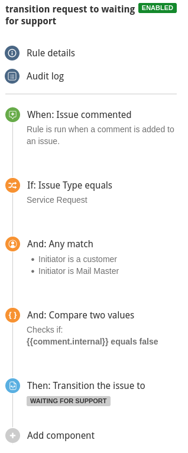  
Don't forget to save the two new automations and you're good to go.

# Configuring Sendgrid
[Set up the inbound parse webhook](https://docs.sendgrid.com/for-developers/parsing-email/setting-up-the-inbound-parse-webhook) selecting both **Spam Check** and **Send Raw**.
The **Destination URL** needs to be under your control so that your reverse proxy routes any incoming HTTPS requests to the inbound_parser docker container.
For staging we currently use `https://mail-inbound.staging.dth.ihost.com` and for production `https://mail-inbound.dth.ihost.com`.
The path needs to be `/inbound`.
Add a `?token=myToken` query parameter with a random token of your choosing.
If you also want to use event handling, [set up the event webhook](https://docs.sendgrid.com/for-developers/tracking-events/getting-started-event-webhook) and choose as many events as you like to be handled.
The path needs to be `/event` and you need to use the same token as before with `?token=myToken`.

# Configuring other Webhook Events (like Sysdig)
You can use `/event?token=myToken` as json webhook for all kinds of services.
All you should do is adjust the `getEventSummary` function in `src/handler/handler.go` and create a pretty summary for your new case.
For Sysdig the summary field is used:
```json
[{
    "summary": "{{@event_title}}",
    "event_body": "{{@event_body}}"
}]
```
`"event_condition_value": "{{@event_condition_value}}",` doesn't work.

# Setting up the inbound_parser with Docker Compose
You need a server running docker with docker compose installed.
Additionally you need valid ssl certification and key file.

Copy the `example_deployment` directory from this repository into `/run/mail-inbound-parser`.
Put your ssl certificate and key file into `/run/mail-inbound-parser/certs`.

Adjust the email templates in `/run/mail-inbound-parser/email_text_plain`.
You only need one template for request creation reply emails and warning emails.

Go through `/run/mail-inbound-parser/config.yaml` and `/run/mail-inbound-parser/docker-compose.yaml` to set everything you need.
Everything is documented there.
The inbound_parser performs an extensive config check at startup, telling what you configured incorrectly.

## Starting the inbound_parser
Go to `/run/mail-inbound-parser` and run `docker compose up -d` (You might need to login first using `docker login containers.github.ibmgcloud.net`; use your username and a personal access token).
You might need to run `docker-compose` instead of `docker compose` depending on your installed version.
To check the logs, run `docker compose logs --follow`.

Now you're all set.

# Setting up the inbound_parser with Ansible
Clone this repo to your local machine and enter the `ansible` directory.
Create a `.vault_pass` file with your—hopefully secure—password for Ansible Vault.
Run `ansible-galaxy collection install -r requirements.yml`.
Then run one of:
- `ansible-playbook -i staging.yml playbook/install.yml`
- `ansible-playbook -i staging.yml playbook/restart.yml`
- `ansible-playbook -i production.yml playbook/install.yml`
- `ansible-playbook -i production.yml playbook/restart.yml`

# Adding a Separate Servicedesk to the same Jira Installation
The inbound_parser allows handling mails for multiple servicedesks on the same Jira installation.
To identify what servicedesk any mail is intended for the `emails` section in the `servicedesks` array in the `jira_installs` array is used (see example_deployment/config.yaml).
The customers can send mails to these emails and the inbound_parser creates new requests in the respective servicedesk.

Unfortunately Jira always replies from the same email address for a given Jira installation.
Therefore the customer will likely reply to that address.
Nevertheless the inbound_parser can identify the intended servicedesk using the request id in the email's subject.
Email addresses that are only used this purpose should be placed in the `emails` section in the `jira_installs` array (see example_deployment/config.yaml).

So when you add a new servicedesk make sure an Jira installation wide email is set and create a new entry in the `servicedesk` array of the affected `jira_installs` entry.
There you have to set all servicedesk specific email addresses.  

For example:  
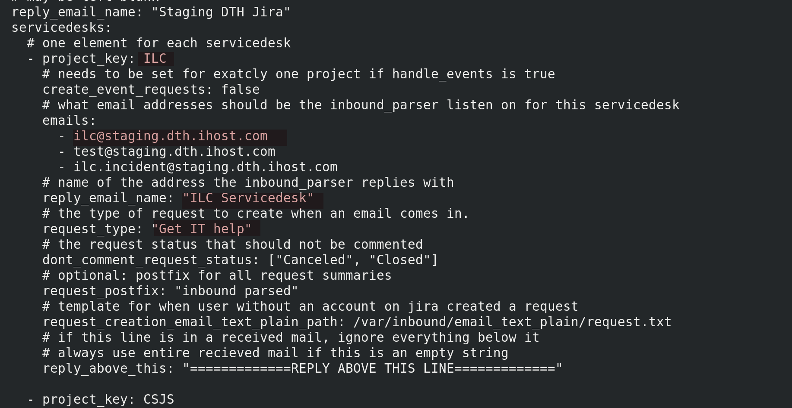  

You can edit or view this file for staging with following commands in the ansible folder, if you are granted to decrypt this file:   
`ansible-vault <edit/view> playbook/roles/inbound-parser/files/inbound_parser_config_staging.yml`

You have to change the red items.  
Please **do not forget** to define a **request type** in the **JSM** that has the **exact same name** as **here** and it must **consist** of at least these 3 fields: **Summary, Description, Attachments** fields. It does not matter whether it is a “hidden” request type or a visible type.  
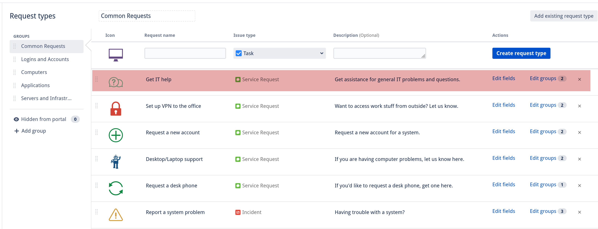
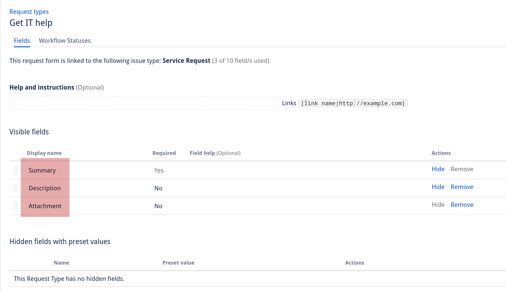

# On the Subject of the 'From' Field
There are two sources for identifying the sender.
The first is the from header in the email itself.
([This is also what Sendgrid sets as its from field.](https://docs.sendgrid.com/for-developers/parsing-email/setting-up-the-inbound-parse-webhook#default-parameters))
The second is the email envelope.

The inbound_parser always prefers the header from and only when that is not defined uses the envelope from.
For normal emails those sources should be the same.
Though, they differ when you redirect or forward emails.

When you forward emails using Outlook you can choose what email address should be in the from header (i.e the original sender).
But the envelope from is still the email account you are performing the forward from.
Outlook's auto forwards don't allow you to set the header from and always use the same email for the header and envelope.

When you auto redirect using Outlook the header contains the original value while the envelope again shows the email account you are performing the redirect from.

## The 'To' Field
The inbound_parser uses the to/cc/bcc headers and the to field in the envelope to figure out if it is being addressed.

## Repopulating the Vendor Dir
Because of [a bug](https://github.com/andygrunwald/go-jira/pull/611) in the jira library every time you `go mod vendor` you need to apply [this fix](https://github.com/andygrunwald/go-jira/pull/611/files) manually.
Refer to [#48](https://github.ibmgcloud.net/dth/mail-inbound-parser/issues/48) for more info.
You can use `go_jira_fix_using_json_unmarshal.patch` for that.

## Updating Dependencies
- `cd src`
- `go get -u`
- `go mod tidy`
- `go mod vendor`
- `patch -i ../go_jira_fix_using_json_unmarshal.patch ./vendor/github.com/andygrunwald/go-jira/jira.go`
- `rm ./vendor/github.com/andygrunwald/go-jira/jira.go.orig`

## Update Tokens
You need two tokens, an admin (sys admin rights are not needed) token and one for the non-admin mail importer account.
They are located in the inbound_parser config files.
If you use Ansible you can find them in `./ansible/playbook/roles/inbound-parser/files/inbound_parser_config_production.yml`.

In the dth infrastructure we use the dthservice_mail_importer account for both tokens.

## Curl API Tests

```
curl --request POST --url 'https://dthdev01.ibmgcloud.net/jira/rest/servicedeskapi/request' --header 'Authorization: Bearer YOUR_TOKEN' --header 'Accept: application/json' --header 'Content-Type: application/json' --data '{ \
             "serviceDeskId": "9", \
             "requestTypeId": "86", \
             "requestFieldValues": { \
                 "summary": "An example", \
                 "description": " https: //dth03. ibmgcloud. net/confluence/display/" \
                 } \
        }'

curl --request GET --url 'https://dthdev01.ibmgcloud.net/jira/rest/servicedeskapi/request?start=1&limit=10' --header 'Authorization: Bearer YOUR_TOKEN' --header 'Accept: application/json' --header 'Content-Type: application/json'
```

